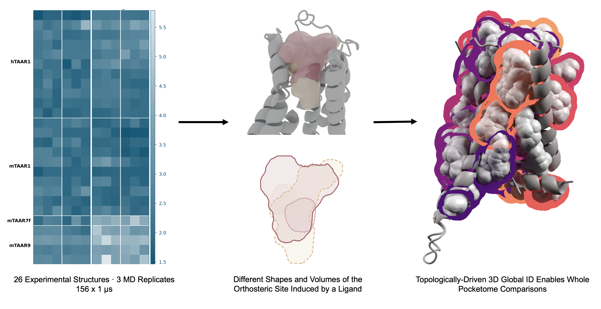

# Dynamic Pocketome of Trace Amine-associated Receptors




## Link to preprint / How to cite: 
https://www.biorxiv.org/content/10.64898/2026.09.14.751399v2; 
Author List: Clarissa Rienaecker; Alessandro Nicoli; Jana Selent; Antonella Di Pizio

Pipeline for comparative pocket (pocketome) analysis of TAAR GPCR structures in
apo and holo states, extended with a global pocket ID scheme that makes
pockets comparable across MD replicates and across the apo/holo split.

Data (MD trajectories, raw pocket-search output, generated figures) is
published separately: **TODO — link to data repository / DOI**. This repo is
code only. Check out our publication at **# TODO: add paper link** for a more detailed explanation. 

The pipeline has two required steps, plus an optional figures step:

1. **Step 1** — turn each wrapped MD trajectory into per-experiment analysis
   results (RMSD/RMSF, pocket search) → `pipeline/analysis_pipeline.py`.
2. **Step 2** — parse and characterise every pocket (2.1), then assign
   **global pocket IDs** so the same pocket is comparable across MD
   replicates, genes and the apo/holo split, and compare apo vs. holo (2.2) →
   `pipeline/pocket_dataframes.py` + `pipeline/global_id_and_comparison.py`.
3. **Step 3** *(optional)* — publication figures and supporting analyses
   (replicate concordance, global-ID heatmap, Blender renders) →
   `taar_paper_figures/`.

`step1_preprocessing_pocket_detection.ipynb` and `step2_pocket_analysis.ipynb`
are documented, end-to-end walkthroughs of Steps 1 and 2 — the entry point for
anyone new to the codebase.

### Tracking progress: `logs/pipeline_summary.csv`

Every stage above (per-experiment: preprocessing, RMSD calculation, pocket
detection, pocket separation, pocket characterisation — plus the dataset-wide
meta-analysis, global-ID and optional-analyses stages) checkpoints itself into
`logs/pipeline_summary.csv` as it runs — `RUNNING` when a stage starts, then
`OK` or `ERROR: <message>` when it ends (see `scripts/run_summary.py`). One
row per (state, PDB ID, replicate) for the per-experiment stages; the
dataset-wide stages share one `ALL/ALL/ALL` row, since Step 2/3 run once over
every experiment together rather than per replicate. A cell stuck on
`RUNNING` after a job has ended means that process was killed mid-stage
(OOM, walltime, node failure, ...).

To (re)build this CSV from whatever result files already exist on disk —
e.g. after a run that predates this checkpoint file, or to sanity-check it
against ground truth — run `python pipeline/build_pipeline_summary.py`
(read-only; each checkpoint is timestamped with the underlying result file's
own mtime, so a stale stage shows its true date rather than looking freshly
verified).

---

## Setup

```bash
conda env create -f environment.yml
conda activate pocket_env
```

This includes `fpocket` (conda-forge), which provides the `mdpocket` binary
`scripts/pocket_analysis.py` shells out to for pocket detection -- despite the
name, `mdpocket`/`dpocket`/`tpocket` all ship together with the `fpocket`
package, same upstream build (https://github.com/Discngine/fpocket).

Tools used by parts of the pipeline but not pip/conda-installable, not bundled
here:

| Tool | Used by                                                                                                         | Install |
|---|-----------------------------------------------------------------------------------------------------------------|--|
| **atclus** | `scripts/pocket_analysis.py` (pocket clustering); Fortran source + build artifacts vendored at `scripts/atclus/` | https://github.com/aachen1995/atclus-4 |
| **Blender + Molecular Nodes** | rendering the pocket figures used in some paper images; not included in this repo                               | https://molecularnodes.org/ |

### Compiling ATClus on a new machine

`scripts/atclus/atclus` is checked in as a pre-built binary, which has to be compiled once per machine. Before running Step 1 for the
first time, rebuild it locally from source:

```bash
gfortran --version   # needs gfortran; if missing: conda install -c conda-forge gfortran (or your system package manager)
cd scripts/atclus
make atclus
```

This uses the `makefile` to recompile `atclus.o` from `atclus.f` /
`atclus.inc` and re-link `atclus` from it. `scripts/pocket_analysis.py`
(`_copy_executable`) copies `atclus.f`, `atclus.inc`, `atclus.o` and the
`atclus` binary into each replicate's `pockets/` directory before running
`./atclus` there, so keep all four in sync — don't hand-replace just the
binary. Plain `make` (no target) also builds `atclus_dbx`, a debug build; `make atclus` alone is enough. `make clean` removes the
build artifacts if you need to start over.

### Directory layout

```
taar-pocketome/
├── config.py               # PROJECT_ROOT / INPUT_DIR / OUTPUT_DIR / ... — single source of truth for paths
├── step1_preprocessing_pocket_detection.ipynb   # Step 1 walkthrough
├── step2_pocket_analysis.ipynb                  # Step 2 walkthrough
├── input/                   # raw MD data — read-only, never written to by the pipeline
│   ├── apo_structures/<state><PDBID>/<replicate>/   # structure.pdb, structure.psf, traj_wrapped.xtc
│   └── holo_structures/<state><PDBID>/<replicate>/
├── output/                  # everything the pipeline writes
│   ├── apo_structures/<state><PDBID>/<replicate>/   # Step 1 per-experiment results, mirrors input/ 1:1
│   │                                                 #   (dry_prot.*, aligned_traj.*, RMSD/RMSF csvs, pockets/, ...)
│   ├── holo_structures/<state><PDBID>/<replicate>/
│   └── meta_analysis/       # everything that aggregates across PDB+rep: Step 2.1's across_genes/
│                             #   dataframes, Step 2.2's global_ID_*/ clustering runs and
│                             #   apo_holo_global_id_mapping/, Step 3's paper_figures/
├── pipeline/                 # Step 1 + Step 2 drivers and library — RMSD/RMSF & pocket-search
│                             #   orchestration, pocket-table parsing, global-ID clustering,
│                             #   binding-site & transiency classification, plotting
├── taar_paper_figures/       # Step 3 — publication figures, replicate concordance, global-ID
│                             #   heatmap/summary (own README below; Blender renders not included)
├── scripts/                  # shared library of per-trajectory primitives (preprocessing,
│                             #   RMSD/RMSF, pocket search) used by Step 1, plus the vendored
│                             #   atclus/ pocket-clustering tool
└── reference_data/            # small lookup tables the pipeline needs to run (GPCRdb numbering,
                                #   gene-name map, binding-site/ICL3 residues)
```

`input/` is exclusively raw data — nothing under it is ever created or
modified by the pipeline. `output/apo_structures/` and
`output/holo_structures/` mirror `input/`'s PDB+rep tree exactly, one output
subtree per input subtree, and are populated by Step 1 as it runs. Anything
that aggregates across more than one PDB+rep pair — Step 2's pocket tables and
global-ID runs, Step 3's figures — lives under `output/meta_analysis/`
instead.

`config.py` resolves `PROJECT_ROOT` from the `TAAR_ROOT` environment variable,
falling back to the current working directory. **Run scripts from the repo
root**, or `export TAAR_ROOT=/path/to/taar-pocketome` first if that's not
convenient (e.g. submitting a job from elsewhere). Drop your own data into
`input/apo_structures/` and `input/holo_structures/` following the layout
above before running Step 1.


---

## Step 1 — per-experiment RMSD/RMSF & pocket search → `pipeline/analysis_pipeline.py`

For every replicate under `input/apo_structures/` and `input/holo_structures/`:

1. Pre-process the trajectory: dry the protein, align to the reference
   topology — `scripts/preprocessing.py`.
2. Calculate RMSD/RMSF — `scripts/basic_analysis.py`. RMSD is computed for the
   protein backbone (Cα), for the binding-site residues and their side
   chains, and for Cα excluding the flexible ICL3 loop — group selections are
   resolved per gene (hTAAR1, mTAAR1, mTAAR7f, mTAAR9) by
   `scripts/gene_selections.py` from `reference_data/binding_site_residues.txt`
   and `reference_data/ICL3_definition.txt`. As the implementation uses
   MDAnalysis, the user can decide what RMSD values should be calculated,
   following their documentation.
3. Run the MDpocket-based pocket search — `scripts/pocket_analysis.py`
   (dummy-atom clustering via the `scripts/atclus/` tool).

Results are written to `output/apo_structures/` and `output/holo_structures/`,
mirroring the input PDB+rep tree (dry protein, aligned trajectory, RMSD/RMSF
CSVs, `pockets/`). This is the only stage that touches raw trajectories;
everything downstream reads its output.

---

## Step 2 — pocket dataframes, global pocket IDs & apo/holo comparison

### 2.1. Pocket dataframes → `pipeline/pocket_dataframes.py`

Turns Step 1's `pockets/` output (mdpocket/ATClus dummy-atom PDBs, descriptor
files, residue files) into per-pocket dataframes:

| Module | Purpose                                                                                                                                                                                            |
|---|----------------------------------------------------------------------------------------------------------------------------------------------------------------------------------------------------|
| `pocket_dataframes.py` | Main driver (`PocketFileParser` + `build_pocket_dataframes`): parses pocket files, interpolates volume across short closures, flags orthosteric/largest/transient pockets, derives `volume_category` |
| `orthosteric_filter_ligand_based.py` | Defines `is_binding_site` (see *Binding-site (orthosteric) definition* below)                                                                                                                      |
| `consecutive_zeros_transiency.py` | Defines `transient` column (see *Transiency definition* below)                                                                                                                                     |
| `pocket_io.py` | Shared CSV/Parquet I/O — every big table is written as both, read back through `load_table()` (parquet preferred)                                                                                  |
| `visualizations.py` | Plotting module, incl. `categorize_volume` (size-category boundaries)                                                                                 |

```python
from pipeline.pocket_dataframes import build_pocket_dataframes, pocket_dirs_for

build_pocket_dataframes(pocket_dirs_for(), saving_loc='output/meta_analysis/across_genes')
```

Writes `all_pockets` (one row per pocket, frame, alpha sphere) and
`pocket_summary` (one row per pocket, first frame) as both `.csv` and
`.parquet`, plus `orthosteric_perframe_volumes.csv`, to
`output/meta_analysis/across_genes/` by default.

#### Binding-site (orthosteric pocket) definition

Computed once by `orthosteric_filter_ligand_based.classify_binding_site`, this
is the only definition of "orthosteric" in the pipeline:

1. Per holo PDB, take the co-crystallized ligand's centroid
   (`load_ligand_centroids`). Apo pockets are scored against their holo counterpart's centroid.
2. A pocket is orthosteric if its own centroid (the mean x/y/z of all its
   dummy-atom/alpha-sphere coordinates, across every frame) is within 5 Å
   (`DEFAULT_DISTANCE_THRESHOLD`) of that ligand centroid.

Stored as `is_binding_site` in Step 2.2's `pocket_comparison_table.csv`, and
merged into `pocket_dataframes.py`'s own output (`all_pockets` /
`pocket_summary`) as `is_orthosteric`.

#### Transiency definition

Computed once by `consecutive_zeros_transiency.classify_transient`, the only
definition of "transient" in the pipeline. A pocket is `transient = True` if
`interpolated_pock_volume == 0`:

- for **at least 10% of its frames in total** (`n_zero_frames`,
  `MIN_ZERO_FRACTION`), **and**
- for **at least 50 of them consecutively** (`max_consecutive_zero_frames`,
  `MIN_CONSECUTIVE_ZERO_FRAMES`) — at 1 ns/frame, a run of ≥50 ns.

Both conditions must hold — this tells real, sustained pocket closures apart
from a handful of scattered zero-volume frames (noise). Consecutive-only
over-flags (a single long closure anywhere counts, however short the rest of
the trajectory); fraction-only under-flags a pocket that's scattered shut for
many individual frames but never closed for long.

### 2.2. Global pocket IDs & apo/holo comparison → `pipeline/global_id_and_comparison.py`

A **global pocket ID** is a dataset-scoped identifier that lets the same
pocket be tracked across MD replicates and across the apo/holo split, where
each run otherwise produces its own independent local numbering. A pocket's
global ID (GID) is only meaningful **within the run that produced it** — two
pockets can only share one if they were voxel-clustered together in the same
call, so IDs from two different runs are not directly comparable (unless
reconciled via `match_states()`, see below).

`run_global_id_states()` runs one or more clustering subsets in a single call
(`states=['apo', 'holo', 'both']`, any combination):

| Run | Subset clustered | Output |
|---|---|---|
| `'both'` (default) | apo + holo together, one shared numbering | `global_ID_combined/`; also runs the apo/holo comparison automatically |
| `'apo'` | apo only | `global_ID_apo/` |
| `'holo'` | holo only | `global_ID_holo/` |

```python
from pipeline.global_id_and_comparison import run_global_id_states
from pipeline import pocket_io
import config as conf

all_pockets = pocket_io.load_table(conf.META_ANALYSIS_DIR, 'all_pockets')
pocket_summary = pocket_io.load_table(conf.META_ANALYSIS_DIR, 'pocket_summary')
results = run_global_id_states(all_pockets, pocket_summary, states=['apo', 'holo', 'both'],
                                source_loc=conf.META_ANALYSIS_DIR, gid_root=conf.META_ANALYSIS_ROOT,
                                pdb_ids=conf.REPRESENTATIVE_PDB_IDS, reconcile_apo_holo=True)
```

Scoping a run through `pdb_ids=` / `genes=`:

`all_pockets`/`pocket_summary` from Step 2.1 always cover every PDB ID — but
clustering all of them into one Global ID run isn't itself a meaningful
comparison. `pdb_ids=` (and
`genes=`) scope a run based on a specific research question: comparing apo vs holo, comparing
one receptor's triplicate MD replicates, or — `conf.REPRESENTATIVE_PDB_IDS`
above, one PDB ID per gene (`8ITF`/mTAAR9, `8JLJ`/mTAAR1, `8JLR`/hTAAR1,
`8PM2`/mTAAR7f) — showcasing Global ID conservation/divergence across a
biologically diverse set of genes. `all_pockets`/`pocket_summary` are
unaffected either way; filter them yourself by the same `pdb_id` column to
see exactly what a given run was scoped to.

Clustering method: 

voxelize every pocket's alpha-sphere point cloud, dilate to
absorb small shifts, compute pairwise Intersection-over-Union, and take
connected components (IoU ≥ threshold) as global IDs. Writes, per run,
`pocket_comparison_table` (one row per local pocket, with its global ID,
gene/state/PDB uniqueness annotations, and the `is_orthosteric` / `transient`
/ `volume_category` columns inherited from Step 2.1), plus diagnostic/QC plots
(`pocket_clusters_qc.html`, per-PDB 3D scatter, upset/bar-chart gene-overlap
plots).

If `'apo'` and `'holo'` are both requested with `reconcile_apo_holo=True`,
`match_states()` additionally reconciles their independent numberings by
bidirectional nearest-centroid matching, writing
`apo_holo_global_id_mapping/global_id_state_mapping.csv`. 
Note that this method was introduced to discuss the GID functionality in the 
paper and probably has no functionality other than that.

The `'both'` run also calls `run_apo_holo_comparison()`, writing
`apo_holo_pocketome_summary.csv`: per-PDB allosteric pocketome metrics (Δ
pocket count, Δ median volume, Jensen–Shannon distance of the size-class
profile, Δ size-class fractions, from `taar_paper_figures/pocketome_metrics.py`)
plus the orthosteric binding-site volume shift (from
`taar_paper_figures/fig2_binding_site.py`).

---

## Step 3 (optional) — publication figures → `taar_paper_figures/`

A figure package (RMSD heatmaps, binding-site, allosteric
pocketome, replicate concordance, global-ID heatmap, Blender panel-D renders)
with its own README (`taar_paper_figures/paper_figures_README.md`) covering
inputs/outputs & the colour system in detail. Note that the paper also includes blender renders, which are not included here.

```bash
python taar_paper_figures/paper_plots.py
```

| Module | Purpose |
|---|---|
| `paper_plots.py` | Entry point for the three publication figures — one colour system, one row order, one entry point |
| `taar_style.py` | Shared palette, gene map loader, row order, panel-letter helpers — every figure module imports this |
| `pocketome_metrics.py` | Apo-vs-holo comparison maths (no plotting); also reused directly by `pipeline/global_id_and_comparison.py` |
| `fig1_rmsd_heatmaps.py` | Figure 1 — RMSD heatmaps + differential |
| `fig2_binding_site.py` | Figure 2 — orthosteric binding site |
| `fig2_panel_d_pockets.py` | Figure 2 panel D — renders + silhouette trace |
| `fig3_pocketome.py` | Figure 3 — allosteric pocketome |
| `global_id_heatmap.py` | Cross-experiment heatmap: rows = global ID, columns = gene → state → replicate, cell = median pocket volume |
| `summary_global_ids_paper.py` | One row per global ID over the combined apo+holo run |
| `gid_replicate_analysis_wrapper.py` | Replicate concordance: descriptive stats (counts, occupancy spectrum, Jaccard vs. permutation null, rarefaction), a silhouette check that global IDs are spatially real, and a threshold-sweep robustness check |
| `replicate_figures.py` | Renders the replicate-concordance figure (count collapse, occupancy, presence matrix, Jaccard heatmap, rarefaction) |

Note the two-way coupling with `pipeline/`: `global_id_and_comparison.py`
imports `taar_style`, `pocketome_metrics` and `fig2_binding_site` from this
package (as `taar_paper_figures.*`), while several modules here import
`pocket_io` and `global_id_and_comparison` back from `pipeline/` via a
`sys.path` insert — see `paper_figures_README.md` for exact inputs/outputs of
each figure.

---

## `scripts/` — shared per-trajectory library

MD preprocessing (drying/aligning), RMSD/RMSF, and pocket search
(mdpocket/ATClus) — the classes Step 1 orchestrates. Actively imported by
Step 1 and by `taar_paper_figures/global_id_heatmap.py`.

| Module | Purpose |
|---|---|
| `preprocessing.py` | `PreProcess` — dry the protein, align to reference topology |
| `basic_analysis.py` | `BasicAnalysis` — RMSD/RMSF calculation and plots |
| `pocket_analysis.py` | `PocketAnalysis` — MDpocket-based pocket search, ATClus dummy-atom clustering |
| `extract_iso.py` | Isosurface PDB extraction from mdpocket's density grid, used by `pocket_analysis.py` |
| `gene_selections.py` | PDB ID → gene lookup and per-gene RMSD group selections (binding site, ICL3) |
| `logging.py` | Trivial print-to-file logger used across the pipeline |
| `atclus/` | Fortran source + build artifacts for the ATClus pocket-clustering tool (see Setup) |

## `reference_data/`

- `TAARs_numbered/` — GPCRdb residue-numbering tables per receptor, used by `pipeline/visualizations.py` (`plot_largest_pockets`, via its `bw_csv_file` argument) to draw Ballesteros-Weinstein helix boundaries.
- `binding_site_residues.txt` / `ICL3_definition.txt` — per-gene residue numbers (+ BW numbering) used for Step 1's RMSD group selections (`scripts/gene_selections.py`).
- `hard_coded_gene_dict.txt` — PDB-ID → gene-name lookup (necessary because the PDB API had some downtime during development, but also mor reliable because it is manually curated)

They are small, static reference tables required for the code to
run —  so they're checked in rather than published with the data.


